# チュートリアル

## 1. テーマのインストール

最初にTumblrにテーマをインストールする方法を開設します。

1. [Tumblr](http://tumblr.com/)にアカウントを作ったら、`新しくブログをつくる`から新規にブログを作成します。

  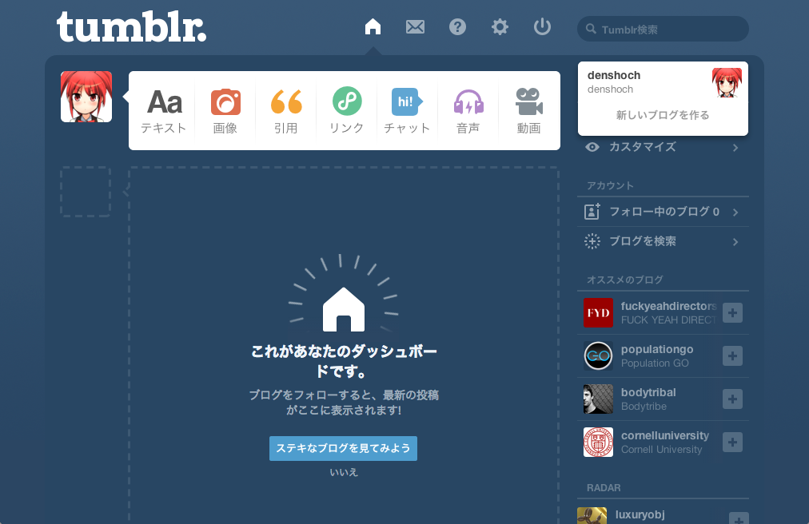

2. 表示されたページで、**タイトル**と**URL**を入力して`新しいブログを作成`ボタンを押します。

    - **タイトル** | このブログの名称。例:「◯◯◯（本の名前）特設ページ」
    - **URL** | このブログのアドレス。

  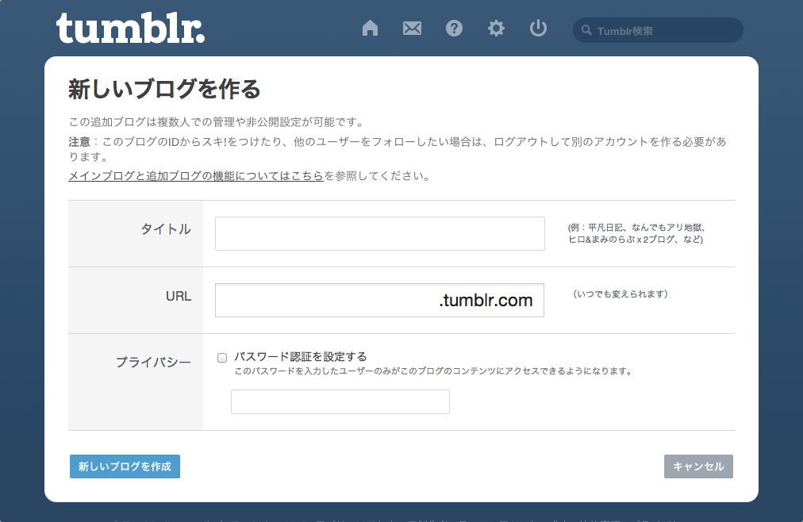

3. ダッシュボード画面に戻ります。作成したブログが選択されていることを確認してから、`カスタマイズ`を押します。

  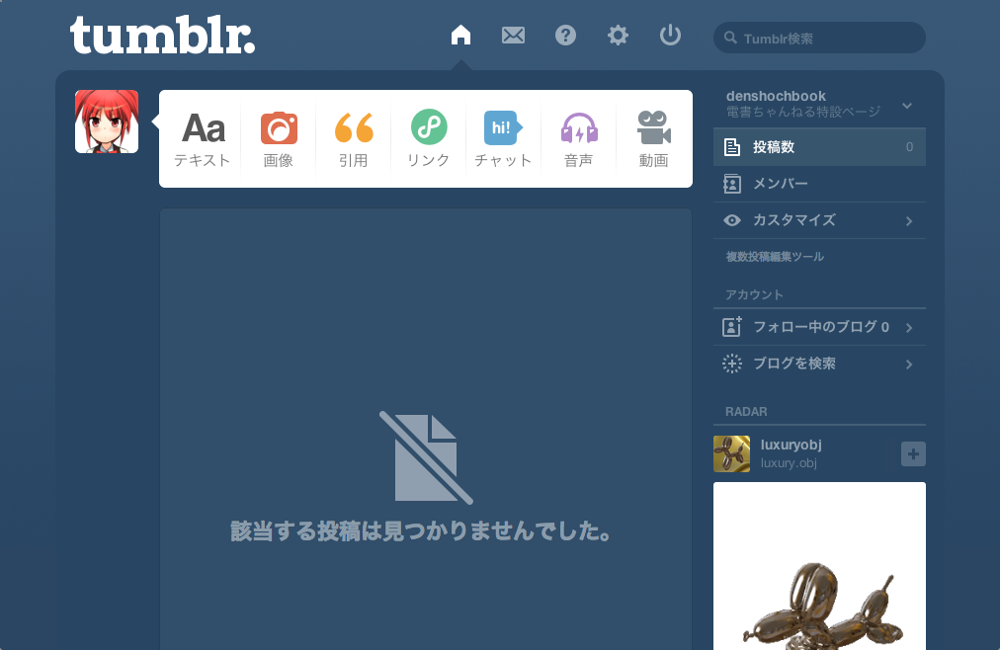

4. テーマの編集画面で`HTMLを編集`を選びます。

  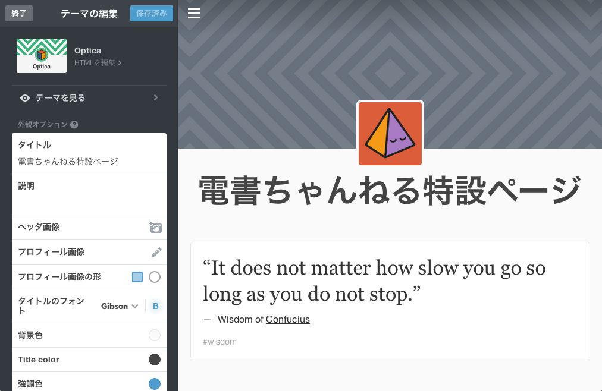

5. HTMLを編集画面の左側にHTMLコードが表示されるので、これをテーマのHTMLコードに置き換えます。[ここ](#)にあるHTMLコードをコピーして貼り付けてください。

  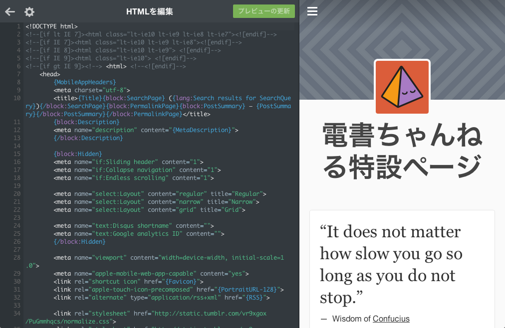

6. コードを貼り付けたら`プレビューの更新`を押して、テーマが反映されたことを確認します。確認できたら`保存`してから`←`を押して前の画面に戻ります。

  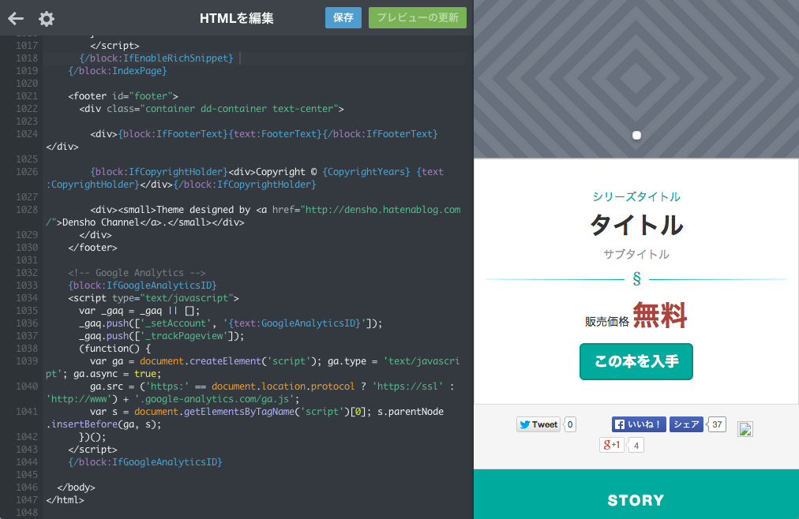

7. テーマの編集画面に戻ったら、左側のメニューの一番下にある`詳細設定`を押します。

  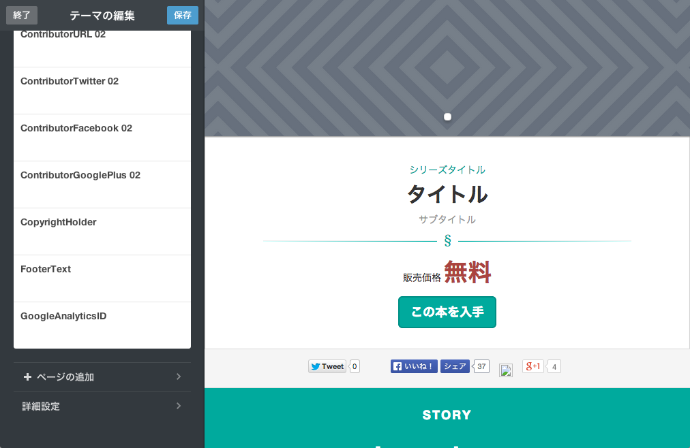

8. 詳細設定画面で**デフォルトのモバイルテーマを使用**と**Tumblrを広める**を無効（灰色の状態）にします。その後`保存`してから`←`を押して前の画面に戻ります。

  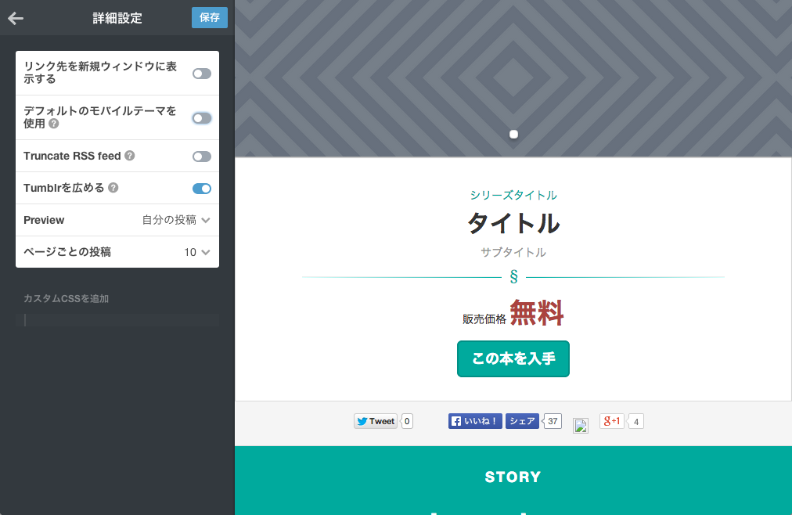

以上でインストールは終了です。お疲れ様でした。

## 2. 必要項目の設定

次にテーマに必要な項目を入力してゆきましょう。

### ページの構成

このテーマはヘッダとフッタの他に、役割の異なる8つのセクションに分かれています。それぞれのセクションは見出しとリード文および各セクション固有のコンテンツで構成されています。利用しないセクションは非表示にすることもできます。セクションの一覧は次のとおりです。

<table>
<tr>
	<th>概要</th><th>見出し（初期値）</th><th>説明</th>
</tr>
<tr>
	<td>内容紹介</td><td>STORY</td><td>本の内容またはストーリーを紹介します。</td>
</tr>
<tr>
	<td>キャラクター紹介</td><td>CHARACTERS</td><td>本に登場するキャラクターを**最大4人**紹介します。</td>
</tr>
<tr>
	<td>試し読み</td><td>PREVIEWS</td><td>本の試し読みバージョンをページに埋め込みます。あるいは試し読みページへのリンクボタンを設置します。</td>
</tr>
<tr>
	<td>作品詳細</td><td>DETAILS</td><td>本の詳細情報を表形式で表示します。</td>
</tr>
<tr>
	<td>レビュー</td><td>REVIEWS</td><td>本のレビューや推薦文を**最大3件**表示します。</td>
</tr>
<tr>
	<td>購入リンク</td><td>GET IT NOW!</td><td>本の購入またはダウンロードするためのリンクボタンを**最大6つ**設置します。</td>
</tr>
<tr>
	<td>関連作品</td><td>RELATED WORKS</td><td>関連作品を**最大4件**紹介します。</td>
</tr>
<tr>
	<td>著者紹介</td><td>CREATED BY</td><td>**最大2名**の著者と**最大2名**の協力者のプロフィールを表示します。</td>
</tr>
</table>

### 全体に関する設定

<table>
<tr>
  <th>概要</th><th>オプション名</th><th>説明</th>
</tr>
<tr>
  <td>レイアウト</td><td>Layout</td><td>テーマの色使いを変更します。n種類の中から選べます。</td>
</tr>
<tr>
  <td>プロフィール画像</td><td>（外観オプション）プロフィール画像</td><td>通常のTumblrではブログの著者のアイコンに使われますが、このテーマではサイトのfaviconにしか使われません。出版者か作品に関する画像をアップロードすることをおすすめします。著者のプロフィール画像は後述する `AuthorImage 01〜06`に別途アップロードしてください。</td>
</tr>
<tr>
  <td>キーワード</td><td>Keywords</td><td>検索用のキーワードです。キーワードをカンマ`,`で区切って記述します。ページの見た目には影響しません。</td>
</tr>
<tr>
  <td>GoogleアナリティクスID</td><td>GoogleAnalyticsID</td><td>GoogleアナリティクスIDを入力すると、アクセス解析ができるようになります。ページの見た目には影響しません *必要ない場合は空欄にしてください。*</td>
</tr>
<tr>
  <td>リッチスニペットを有効にする／無効にする</td><td>EnableRichSnippet</td><td>検索エンジン向けのメタデータの出力を制御します。ページの見た目には影響しません。特に理由がない限り有効にしてください。</td>
</tr>
</table>

### ヘッダに関する設定

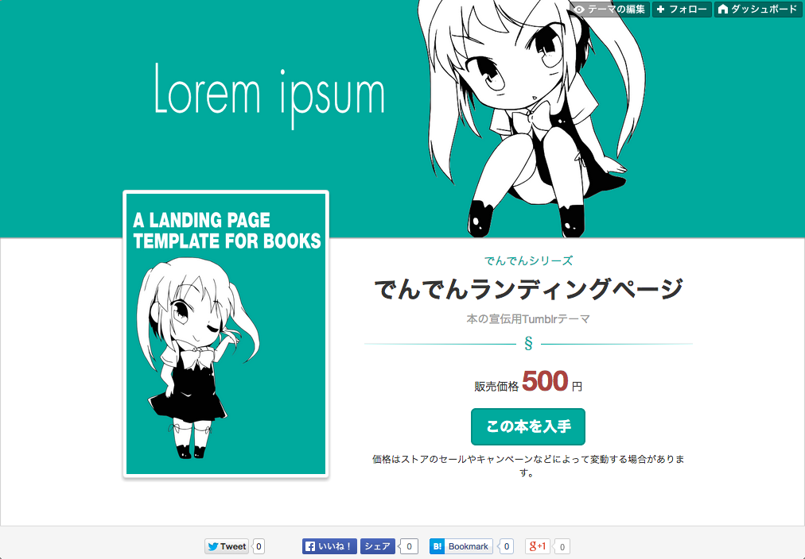

ページの最上部の領域です。ここでは次の項目を設定します。

<table>
<tr>
	<th>概要</th><th>オプション名</th><th>説明</th>
</tr>
<tr>
	<td>ヘッダ画像</td><td>（外観オプション） ヘッダ画像</td><td>ヘッダーの背景に表示される画像です。</td>
</tr>
<tr>
	<td>表紙画像</td><td>CoverImage</td><td>本の表紙画像です。**横幅260px以上**のものを推奨します。</td>
</tr>
<tr>
	<td>タイトル</td><td>BookTitle</td><td>本のタイトルです。</td>
</tr>
<tr>
	<td>サブタイトル</td><td>BookSubtitle</td><td>本のサブタイトルです。*必要ない場合は空欄にしてください。*</td>
</tr>
<tr>
	<td>シリーズタイトル</td><td>BookCollectionTitle</td><td>本のシリーズ名などを表すタイトルです。*必要ない場合は空欄にしてください。*</td>
</tr>
<tr>
	<td>販売価格</td><td>Price</td><td>本の価格を数値で入力します。`0`または空欄の場合には無料と表示されます。</td>
</tr>
</table>

### 内容紹介セクションに関する設定

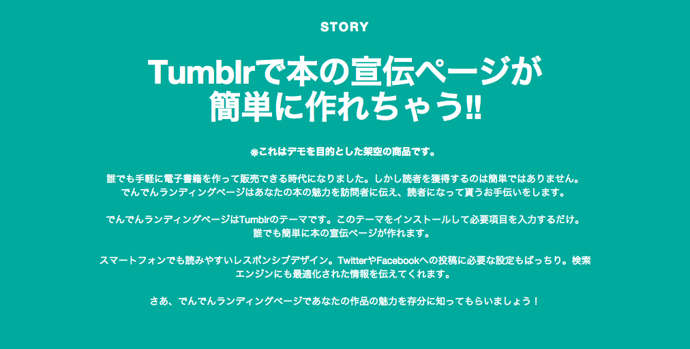

読者に本の内容またはストーリーを紹介して興味を持ってもらうためのセクションです。ここでは次の項目を設定します。

<table>
<tr>
	<th>概要</th><th>オプション名</th><th>説明</th>
</tr>
<tr>
	<td>セクションの表示／非表示</td><td>ShowSectionDescription</td><td>このセクションの表示／非表示にするスイッチです。無効にするとこのセクションはページに表示されません。</td>
</tr>
<tr>
	<td>見出し</td><td>SectionDescription Heading</td><td>見出しです。</td>
</tr>
<tr>
	<td>リード文</td><td>SectionDescription Lead</td><td>リード文です。読者の興味を引く短い文章を入力します。改行には` `を入力してください。*必要ない場合は空欄にしてください。*</td>
</tr>
<tr>
	<td>説明文</td><td>（外観オプション） 説明</td><td>リード文です。本の内容やストーリーを紹介する文章を入力します。改行には` `を入力してください。</td>
</tr>
</table>

### キャラクター紹介セクションに関する設定

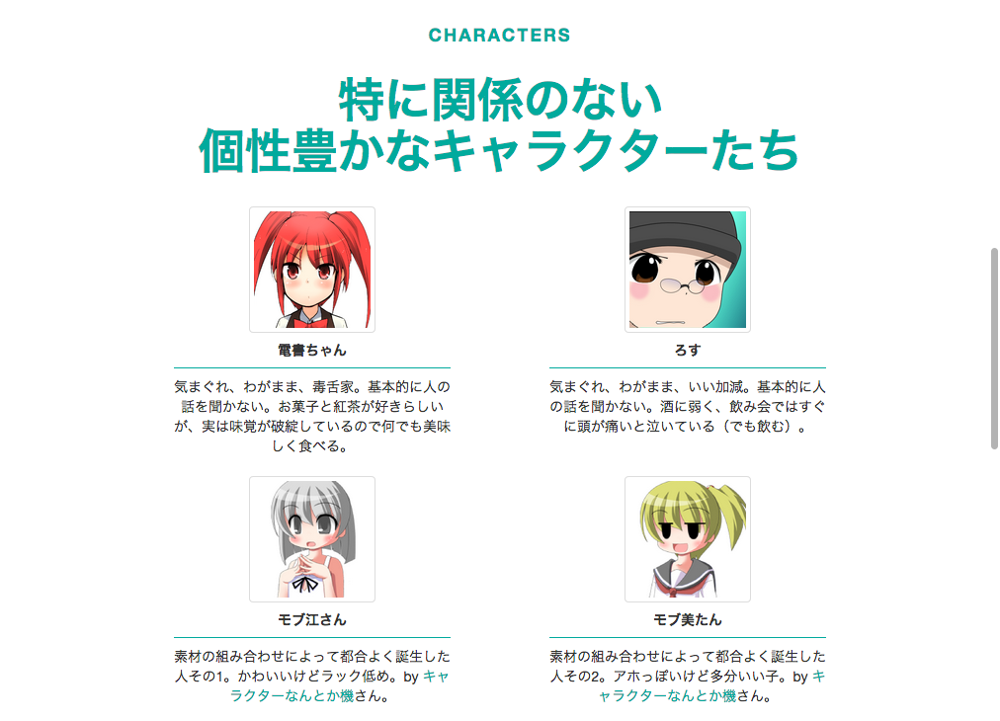

本に登場するキャラクターを紹介するセクションです。ここでは次の項目を設定します。

<table>
<tr>
	<th>概要</th><th>オプション名</th><th>説明</th>
</tr>
<tr>
	<td>セクションの表示／非表示</td><td>ShowSectionCharacters</td><td>このセクションの表示／非表示にするスイッチです。無効にするとこのセクションはページに表示されません。</td>
</tr>
<tr>
	<td>見出し</td><td>SectionCharacters Heading</td><td>見出しです。</td>
</tr>
<tr>
	<td>リード文</td><td>SectionCharacters Lead</td><td>リード文です。読者の興味を引く短い文章を入力します。改行には` `を入力してください。*必要ない場合は空欄にしてください。*</td>
</tr>
<tr>
	<td>カラム数</td><td>ColumnCount Characters</td><td>大きな画面で表示した場合に、何名のキャラクターを1列に表示するのか指定します。推奨値は、キャラクターが1名の場合:`1`、キャラクターが2名の場合:`2`、キャラクターが3名の場合: `3`、キャラクターが4名の場合:`2`または`4`です。</td>
</tr>
<tr>
	<td>キャラクター画像</td><td>CharacterImage 01〜04</td><td>キャラクターの画像です。**128px以上の正方形**の画像を推奨します。指定しない場合はこのテーマが提供する代替画像が表示されます。</td>
</tr>
<tr>
	<td>キャラクター名</td><td>CharacterName 01〜04</td><td>キャラクターの名前です。名前を設定しないキャラクターはページに表示されないので注意してください。</td>
</tr>
<tr>
	<td>キャラクター説明</td><td>CharacterDesc 01〜04</td><td>キャラクターの説明文です。改行には` `を入力してください。</td>
</tr>
</table>

### 試し読みセクションに関する設定

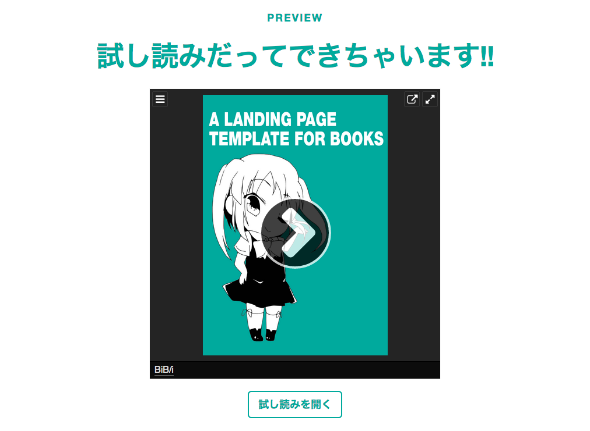

本の試し読みを提供するセクションです。Tumblrやこのテーマ自体は試し読み機能を持っていません。実現するには外部のサービスと組み合わせる必要があります。詳しくは別途解説します。ここでは次の項目を設定します。

<table>
<tr>
	<th>概要</th><th>オプション名</th><th>説明</th>
</tr>
<tr>
	<td>セクションの表示／非表示</td><td>ShowSectionPreview</td><td>このセクションの表示／非表示にするスイッチです。無効にするとこのセクションはページに表示されません。</td>
</tr>
<tr>
	<td>見出し</td><td>SectionPreview Heading</td><td>見出しです。</td>
</tr>
<tr>
	<td>リード文</td><td>SectionPreview Lead</td><td>リード文です。読者の興味を引く短い文章を入力します。改行には` `を入力してください。*必要ない場合は空欄にしてください。*</td>
</tr>
<tr>
	<td>埋め込みコード</td><td>PreviewEmbedCode</td><td>BCCKSやBiB/iを利用してEPUBのビューワを埋め込むことができます。埋め込むコードを貼り付けてください。*必要ない場合は空欄にしてください。*</td>
</tr>
<tr>
	<td>試し読みリンク</td><td>PreviewLink</td><td>試し読みのリンクボタンを設置します。試し読みページや試し読みファイルがある場合に、URLを指定します。*必要ない場合は空欄にしてください。*</td>
</tr>
</table>

### 作品詳細セクションに関する設定

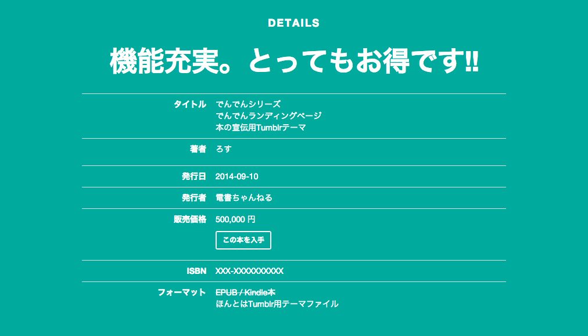

本の詳細情報を表形式で表示するセクションです。ここでは次の項目を設定します。

<table>
<tr>
	<th>概要</th><th>オプション名</th><th>説明</th>
</tr>
<tr>
	<td>セクションの表示／非表示</td><td>ShowSectionDetails</td><td>このセクションの表示／非表示にするスイッチです。無効にするとこのセクションはページに表示されません。</td>
</tr>
<tr>
	<td>見出し</td><td>SectionDetails Heading</td><td>見出しです。</td>
</tr>
<tr>
	<td>リード文</td><td>SectionDetails Lead</td><td>リード文です。読者の興味を引く短い文章を入力します。改行には` `を入力してください。*必要ない場合は空欄にしてください。*</td>
</tr>
<tr>
	<td>発行日</td><td>SectionDetails DatePublished</td><td>発行日をYYYY-MM-DDの形式で記述します。**この形式を守らないと検索エンジン向けのメタデータが不正になるので注意してください。**。*必要ない場合は空欄にしてください。*</td>
</tr>
<tr>
	<td>出版者名</td><td>SectionDetails PublisherName</td><td>出版者／出版社の名称です。**。*必要ない場合は空欄にしてください。*</td>
</tr>
<tr>
	<td>出版者URL</td><td>SectionDetails PublisherURL</td><td>出版者／出版社のウェブサイトなどのURLです。**。*必要ない場合は空欄にしてください。*</td>
</tr>
<tr>
	<td>ISBN</td><td>SectionDetails ISBN</td><td>ISBN番号がある場合にはここに記述してください。**。*必要ない場合は空欄にしてください。*</td>
</tr>
<tr>
	<td>電子書籍識別</td><td>Format EBook</td><td>検索エンジン向けの情報です。電子書籍の場合には有効にしてください。ページの見た目には影響しません。</td>
</tr>
<tr>
	<td>フォーマット</td><td>SectionDetails FormatDesc</td><td>ファイル形式や判型／ページ数（紙の本の場合）などを、説明する文章を入力します。*必要ない場合は空欄にしてください。*</td>
</tr>
</table>

### レビューセクションに関する設定

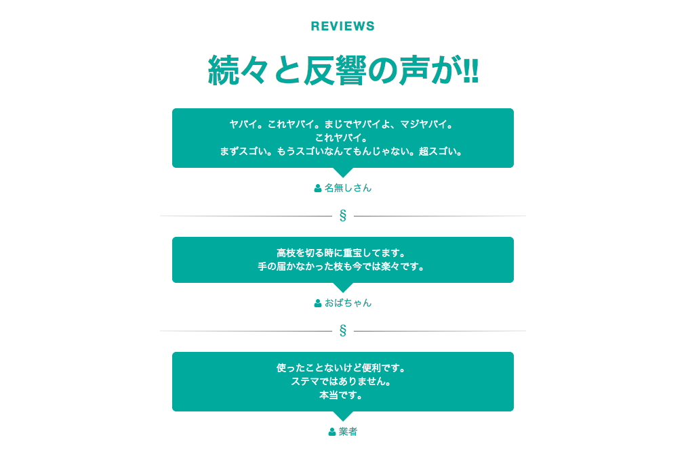

本のレビューや推薦文を掲載するセクションです。ここでは次の項目を設定します。

<table>
<tr>
	<th>概要</th><th>オプション名</th><th>説明</th>
</tr>
<tr>
	<td>セクションの表示／非表示</td><td>ShowSectionReviews</td><td>このセクションの表示／非表示にするスイッチです。無効にするとこのセクションはページに表示されません。</td>
</tr>
<tr>
	<td>見出し</td><td>SectionReviews Heading</td><td>見出しです。</td>
</tr>
<tr>
	<td>リード文</td><td>SectionReviews Lead</td><td>リード文です。読者の興味を引く短い文章を入力します。改行には` `を入力してください。*必要ない場合は空欄にしてください。*</td>
</tr>
<tr>
	<td>レビューコメント</td><td>ReviewComment 01〜03</td><td>レビューまたは推薦文です。改行には` `を入力してください。*必要ない場合は空欄にしてください。*</td>
</tr>
<tr>
	<td>レビューアー</td><td>ReviewerName 01〜03</td><td>レビューまたは推薦文を書いてくれた人の名前です。</td>
</tr>
<tr>
	<td>レビューアーURL</td><td>ReviewerURL 01〜03</td><td>レビューアーに関するURLです。レビューアーのウェブサイトや、レビューの掲載されているブログなどへのURLを記入します。*必要ない場合は空欄にしてください。*</td>
</tr>
</table>

### 購入リンクセクションに関する設定

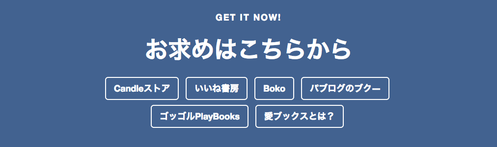

訪問者に本の購入またはダウンロードしてもらうためのセクションです。ここでは次の項目を設定します。

<table>
<tr>
	<th>概要</th><th>オプション名</th><th>説明</th>
</tr>
<tr>
	<td>セクションの表示／非表示</td><td>ShowSectionAcquisition</td><td>このセクションの表示／非表示にするスイッチです。無効にするとこのセクションはページに表示されません。</td>
</tr>
<tr>
	<td>見出し</td><td>SectionAcquisition Heading</td><td>見出しです。</td>
</tr>
<tr>
	<td>リード文</td><td>SectionAcquisition Lead</td><td>リード文です。読者の興味を引く短い文章を入力します。改行には` `を入力してください。*必要ない場合は空欄にしてください。*</td>
</tr>
<tr>
	<td>リンクラベル</td><td>AcquisitionLinkLabel 01〜06</td><td>リンクボタンに表示するテキストです。このテキストがないボタンは表示されません。*必要ない場合は空欄にしてください。*</td>
</tr>
<tr>
	<td>リンクURL</td><td>AcquisitionLinkURL 01〜06</td><td>リンクボタンが参照するURLです。販売ストアのページや直接無料配布する場合はファイルのURLを記述します。</td>
</tr>
</table>

### 関連作品セクションに関する設定

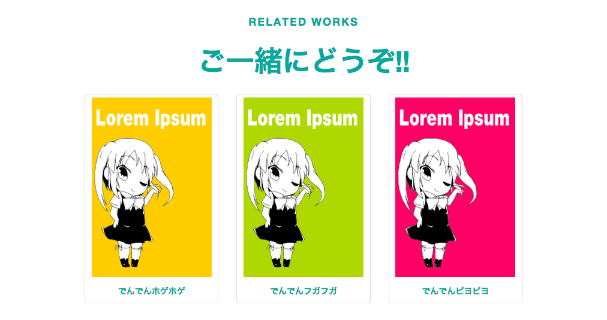

関連作品を紹介するセクションです。ここでは次の項目を設定します。

<table>
<tr>
	<th>概要</th><th>オプション名</th><th>説明</th>
</tr>
<tr>
	<td>セクションの表示／非表示</td><td>ShowSectionRelatedWorks</td><td>このセクションの表示／非表示にするスイッチです。無効にするとこのセクションはページに表示されません。</td>
</tr>
<tr>
	<td>見出し</td><td>SectionRelatedWorks Heading</td><td>見出しです。</td>
</tr>
<tr>
	<td>リード文</td><td>SectionRelatedWorks Lead</td><td>リード文です。読者の興味を引く短い文章を入力します。改行には` `を入力してください。*必要ない場合は空欄にしてください。*</td>
</tr>
<tr>
	<td>表紙画像</td><td>RelatedWorkImage 01〜04</td><td>関連作品の表紙画像です。**幅200px以上**を推奨します。</td>
</tr>
<tr>
	<td>タイトル</td><td>RelatedWorkImage 01〜04</td><td>関連作品のタイトルです。</td>
</tr>
<tr>
	<td>URL</td><td>RelatedWorkURL 01〜04</td><td>関連作品のURLです。</td>
</tr>
</table>

### 著者紹介セクションに関する設定

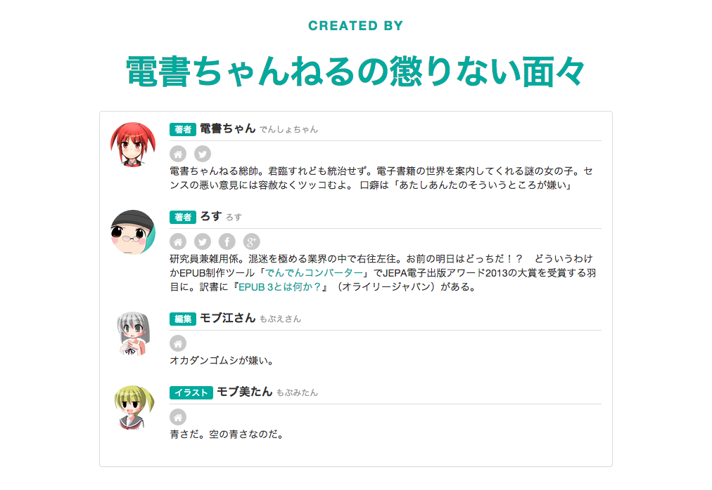

著者や協力者のプロフィールを掲載するセクションです。協力者とは作品に二次的な貢献をしてた人または団体です。ここでは次の項目を設定します。

<table>
<tr>
	<th>概要</th><th>オプション名</th><th>説明</th>
</tr>
<tr>
	<td>セクションの表示／非表示</td><td>ShowSectionBiographies</td><td>このセクションの表示／非表示にするスイッチです。無効にするとこのセクションはページに表示されません。</td>
</tr>
<tr>
	<td>見出し</td><td>SectionBiographies Heading</td><td>見出しです。</td>
</tr>
<tr>
	<td>リード文</td><td>SectionBiographies Lead</td><td>リード文です。読者の興味を引く短い文章を入力します。改行には` `を入力してください。*必要ない場合は空欄にしてください。*</td>
</tr>
<tr>
  <td>著者画像</td><td>AuthorImage 01〜02</td><td>著者の画像です。**128px以上の正方形**の画像を推奨します。*必要ない場合は空欄にしてください。*</td>
</tr>
<tr>
  <td>著者名</td><td>AuthorName 01〜02</td><td>著者の名前です。名前のない著者は他の項目が入力されていてもページには表示されません。*必要ない場合は空欄にしてください。*</td>
</tr>
<tr>
  <td>著者仮名名</td><td>AuthorNameKana 01〜02</td><td>著者の名前の仮名表記です。*必要ない場合は空欄にしてください。*</td>
</tr>
<tr>
  <td>著者説明</td><td>AuthorDescription 01〜02</td><td>著者の略歴などの文章を入力します。改行には` `を入力してください。</td>
</tr>
<tr>
  <td>著者URL</td><td>AuthorURL 01〜02</td><td>著者のウェブサイトやブログなどのURLを入力します。*必要ない場合は空欄にしてください。*</td>
</tr>
<tr>
  <td>著者Twitterアカウント</td><td>AuthorTwitter 01〜02</td><td>著者のTwitterアカウント名から`@`を除いた文字列を入力します。*必要ない場合は空欄にしてください。*</td>
</tr>
<tr>
  <td>著者Facebookアカウント</td><td>AuthorFacebook 01〜02</td><td>著者のFacebookアカウント名を入力します。*必要ない場合は空欄にしてください。*</td>
</tr>
<tr>
  <td>著者Google+アカウント</td><td>AuthorGooglePlus 01〜02</td><td>著者のGoogle+アカウント名から`+`を除いた文字列を入力します。*必要ない場合は空欄にしてください。*</td>
</tr>
<tr>
  <td>協力者画像</td><td>ContributorImage 01〜02</td><td>協力者の画像です。**128px以上の正方形**の画像を推奨します。*必要ない場合は空欄にしてください。*</td>
</tr>
<tr>
  <td>協力者名</td><td>ContributorName 01〜02</td><td>協力者の名前です。名前のない協力者は他の項目が入力されていてもページには表示されません。*必要ない場合は空欄にしてください。*</td>
</tr>
<tr>
  <td>協力者仮名名</td><td>ContributorNameKana 01〜02</td><td>協力者の名前の仮名表記です。*必要ない場合は空欄にしてください。*</td>
</tr>
<tr>
  <td>協力者の役割</td><td>ContributorRole 01〜02</td><td>協力者が作品に果たした役割を入力します。*必要ない場合は空欄にしてください。*</td>
</tr>
<tr>
  <td>協力者説明</td><td>ContributorDescription 01〜02</td><td>協力者の略歴などの文章を入力します。改行には` `を入力してください。</td>
</tr>
<tr>
  <td>協力者URL</td><td>ContributorURL 01〜02</td><td>協力者のウェブサイトやブログなどのURLを入力します。*必要ない場合は空欄にしてください。*</td>
</tr>
<tr>
  <td>協力者Twitterアカウント</td><td>ContributorTwitter 01〜02</td><td>協力者のTwitterアカウント名から`@`を除いた文字列を入力します。*必要ない場合は空欄にしてください。*</td>
</tr>
<tr>
  <td>協力者Facebookアカウント</td><td>ContributorFacebook 01〜02</td><td>協力者のFacebookアカウント名を入力します。*必要ない場合は空欄にしてください。*</td>
</tr>
<tr>
  <td>協力者Google+アカウント</td><td>ContributorGooglePlus 01〜02</td><td>協力者のGoogle+アカウント名から`+`を除いた文字列を入力します。*必要ない場合は空欄にしてください。*</td>
</tr>
</table>

### フッタに関する設定

ページの最下部の領域です。ここでは次の項目を設定します。

<table>
<tr>
  <th>概要</th><th>オプション名</th><th>説明</th>
</tr>
<tr>
  <td>著作権者</td><td>CopyrightHolder</td><td>このページの著作権者名をアルファベットで入力します。紹介する本の著作権者ではないことに注意してください。*必要ない場合は空欄にしてください。*</td>
</tr>
<tr>
  <td>フッタテキスト</td><td>FooterText</td><td>フッタに表示する任意の文章があれば入力します。*必要ない場合は空欄にしてください。*</td>
</tr>
</table>
